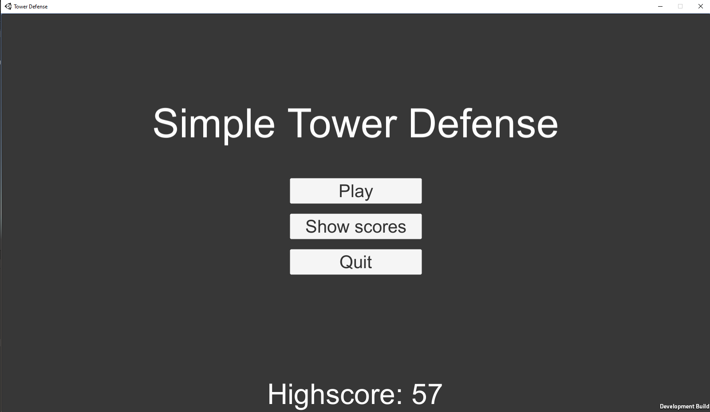
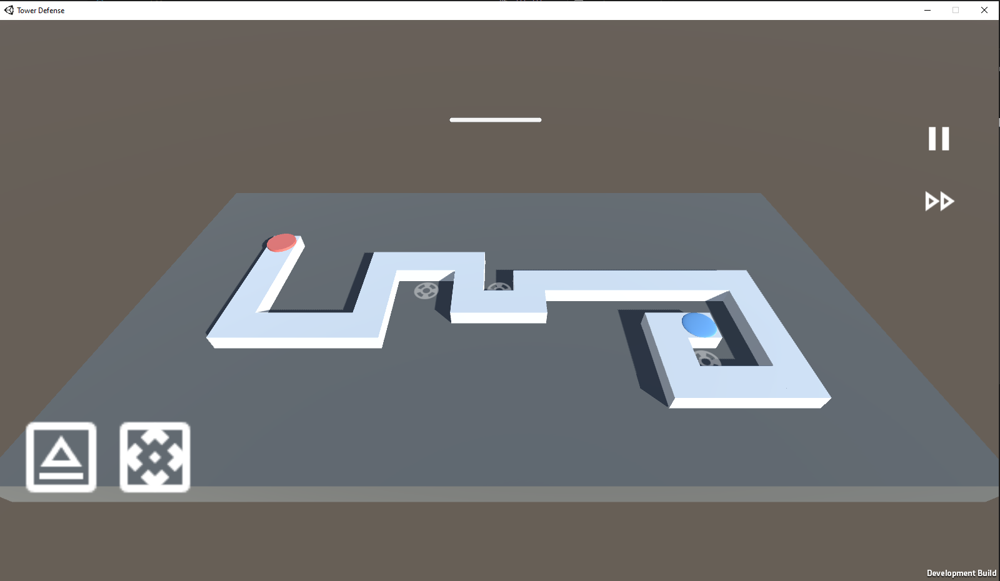
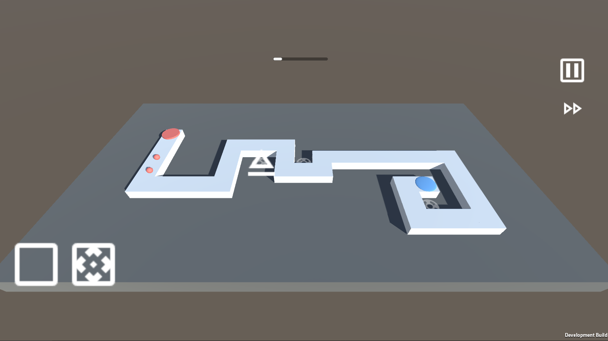
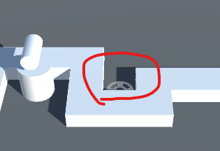
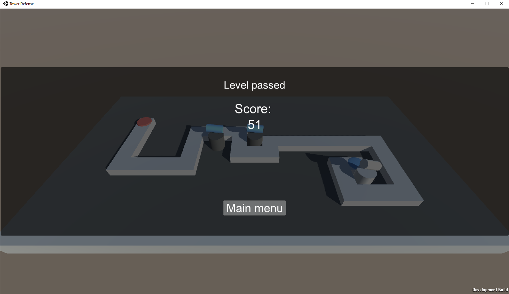
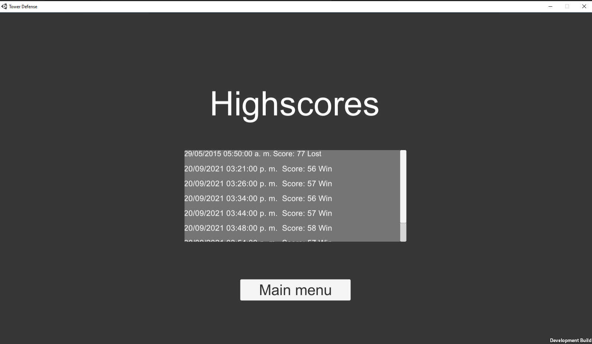
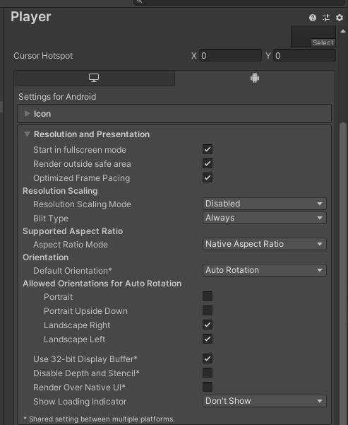
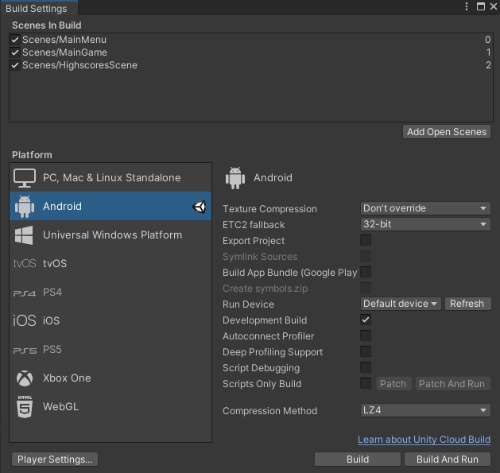

# Tower-Defense

This project is a one-level, tower defense game made with unity3D, exclusively created without any external assets or packages.

## How to play
The level consists of a simple board with a red marker (enemy spawner), a blue marker (the base), and a couple of gray markers (places in which turrets can be placed). Aditionally, the superior bar will track your progress through the level, and you can press the pause button and the fast forward button at any time:

The inferior buttons can be dragged into a gray marker in order to build a tower directly on it, each button instances a different turret:

At the end of the level (if you win or lose) your score will be stored remotely; you may go back to the main menu in this stage:

Finally, all the stored scores will be shown on the highscores tab (accessible through the main menu), as well as the completion date and if the level was failed or not:

## Compiling instructions (Android version)

Besides the allowed orientations, neither of the project initial configuration was changed, so an executale can be built by accessing to **File->Build Settings** and clicking **Build and run** if an Android phone is connected and it's desired to install the app on it, or just **Build** to only produce an apk file: 
Project | Build
- | - 
 | 

A file explorer window may appear to select on which folder the app will be placed. Upon completion, the resulting apk file can be installed on a phone that allows external applications.

