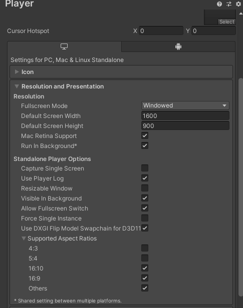
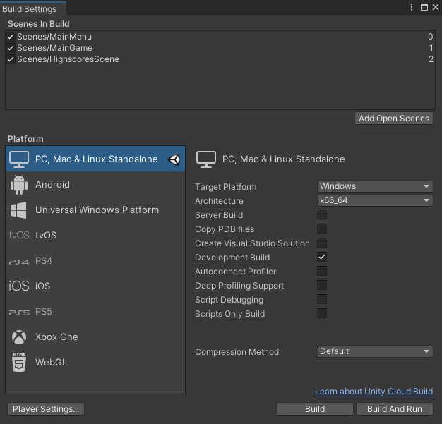
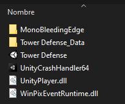

# Tower-Defense

This project is a one-level, tower defense game made with unity3D, exclusively created without any external assets or packages.

## How to play
The level consists of a simple board with a red marker (enemy spawner), a blue marker (the base), and a couple of gray markers (places in which turrets can be placed). Aditionally, the superior bar will track your progress through the level, and you can press the pause button and the fast forward button at any time:

The inferior buttons can be dragged into a gray marker in order to build a tower directly on it, each button instances a different turret:

At the end of the level (if you win or lose) your score will be stored remotely; you may go back to the main menu in this stage:

Finally, all the stored scores will be shown on the highscores tab (accessible through the main menu), as well as the completion date and if the level was failed or not:

## Compiling instructions (PC version)

Besides the default resolution, neither of the project initial configuration was changed, so an executale can be built by accessing to **File->Build Settings** and clicking **Build and run**, creating an empty folder is advisable due to the creation of various files within the process: 
Project | Build
- | - 
 | 

Upon completion, the resulting executale structure should look something like the following, now the "Tower Defense.exe" file can be clicked in order to play the game (the .exe file must be on the same folder as the other files!):

